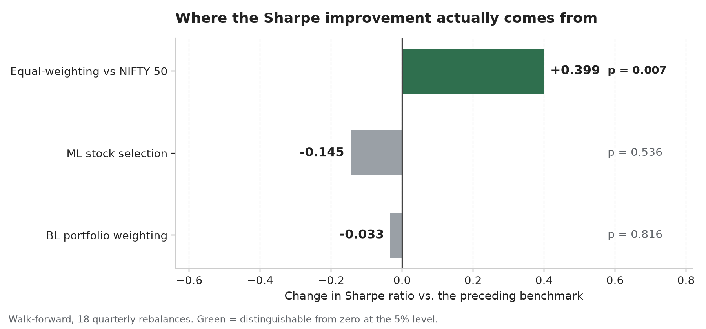
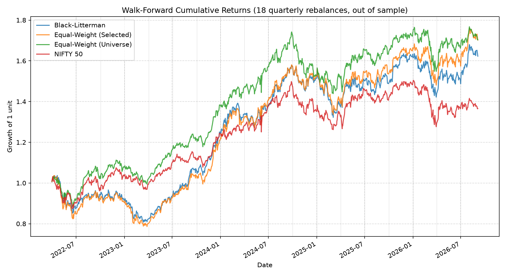
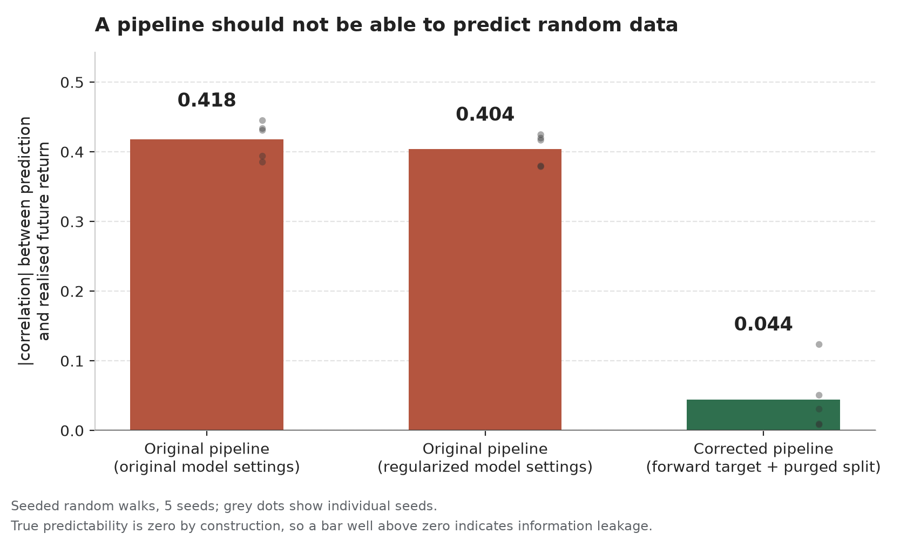

# FinOptix — Portfolio Optimization

[](https://github.com/Architathakur/FinOptix---Portfolio-Optimization/actions/workflows/tests.yml)

An end-to-end portfolio research pipeline that combines **XGBoost return forecasts**, **Black-Litterman allocation**, and **leakage-safe walk-forward evaluation** for NSE large-cap equities.

The project is built around a simple question: **does the forecasting signal actually add value once selection, weighting, transaction costs, and benchmark effects are separated cleanly?**

**Stack:** Python · pandas · NumPy · XGBoost · scikit-learn · PyPortfolioOpt · yfinance · pytest · GitHub Actions

## Key results

| Result | Walk-forward finding |
|---|---:|
| Evaluation window | **18 quarterly rebalances**, 2022-04 to 2026-09 |
| Out-of-sample IC observations | **52 non-overlapping periods** |
| Cross-sectional rank IC | **0.0096** (t = 0.37) |
| Black-Litterman Sharpe | **0.830** |
| Equal-weight universe Sharpe | **1.008** |
| NIFTY 50 Sharpe | **0.611** |
| Equal-weighting effect | **+0.399 Sharpe** (p = 0.007) |
| ML stock-selection effect | **−0.145 Sharpe** (p = 0.536) |
| Black-Litterman weighting effect | **−0.033 Sharpe** (p = 0.816) |
| Automated tests | **32** synthetic/offline tests |

> **Main finding:** strict out-of-sample evaluation shows that the apparent Sharpe uplift is explained by **equal-weighting the universe** (+0.399, p = 0.007), while ML stock selection and Black-Litterman weighting add no statistically significant improvement. The central result is the attribution itself: the pipeline separates genuine strategy contribution from performance that would otherwise be easy to misattribute.



*Takeaway: the apparent improvement over the NIFTY 50 comes from equal-weighting the stock universe. The model-driven stock-selection and portfolio-weighting layers do not add measurable Sharpe in the walk-forward evaluation.*

### Walk-forward performance

Every allocation below is formed using information available before the corresponding hold window. Weights are held through each quarter, transaction costs are charged on turnover against the drifted portfolio, and the four streams are stitched into one out-of-sample series.



*This chart tracks how each portfolio grows through the stitched out-of-sample hold periods — each segment was allocated using only prior information. The equal-weight universe (green) reaches roughly the same level as the ML-selected portfolio with visibly shallower drawdowns, and stays ahead of Black-Litterman and the NIFTY 50. Smoother growth for the same end point is what produces its higher Sharpe ratio, and it is why benchmark choice drives the attribution below.*

The equal-weight universe finishes with the strongest risk-adjusted performance: a Sharpe of 1.008 against 0.863 for the ML-selected portfolio and 0.830 for Black-Litterman, on lower volatility and a shallower maximum drawdown. Neither model-driven portfolio improves on it, which is consistent with the near-zero rank IC.

---

## What this project demonstrates

This repository is more than a portfolio-optimization notebook. It implements a complete research and evaluation workflow with explicit controls against common backtesting errors.

- **ML pipeline:** 14 trailing, scale-free features → per-ticker XGBoost forecasts → cross-sectional ranking.
- **Portfolio construction:** model forecasts become Black-Litterman views, followed by maximum-Sharpe optimization.
- **Leakage control:** purged TRAIN / VALID / HOLD windows with forward-label boundaries tested explicitly.
- **Evaluation aligned with the decision:** cross-sectional rank IC instead of only per-ticker time-series correlation.
- **Attribution:** separate benchmarks isolate equal-weighting, stock selection, and portfolio weighting.
- **Realistic accounting:** buy-and-hold weight drift, rebalance turnover, and transaction costs.
- **Statistical testing:** bootstrapped Sharpe-difference confidence intervals and p-values.
- **Software engineering:** modular `src/` package, CLI configuration, data caching/retries, synthetic-data tests, smoke tests, and CI.

### Pipeline at a glance

```mermaid
flowchart LR
    A[Yahoo Finance OHLCV] --> B[14 trailing scale-free features]
    B --> C[Purged XGBoost training per ticker]
    C --> D[Cross-sectional return forecasts]
    D --> E[Rank and select Top-N]
    E --> F[Black-Litterman views]
    F --> G[Max-Sharpe portfolio]
    G --> H[Quarterly out-of-sample hold]
    H --> I[Benchmarks + turnover costs]
    I --> J[Rank IC + bootstrap attribution]
```



---

## The leakage bug that changed the project

An earlier version reported per-ticker prediction correlations of **0.212–0.516** and a portfolio that appeared to beat its benchmark by roughly ten percentage points of CAGR.

Those numbers were wrong.

### What the bug was

The original target was the return *ending* at day `t`, while several rolling features also included `Close[t]`:

```python
feat["returns"] = df["Close"].pct_change()          # return ending at t
feat["ma_10"] = df["Close"].rolling(10).mean()      # includes Close[t]
feat["volatility_20"] = df["Close"].rolling(20).std()
feat["upper_band"] = ma_20 + 2 * std_20
```

The model was effectively given information from the same close used to construct the target.

### How the diagnosis was verified

The feature pipeline was tested on a seeded random walk, where future returns are unpredictable by construction. A clean pipeline should therefore produce correlation close to zero.

| Setup | Absolute correlation on random walk |
|---|---:|
| Original features + same-day target + original XGB parameters | **0.418** |
| Original features + same-day target + regularized XGB parameters | **0.404** |
| Current features + 21-day forward target + purged split | **0.044** |



*This is a sanity check on the research pipeline: random data should not be meaningfully predictable. The original pipeline appears highly predictive because it leaks future information, while the corrected pipeline falls close to the expected noise floor.*

The regularized leaky model still scores 0.404, so the abnormal result was not explained by ordinary model overfitting. The feature/target construction itself was leaking information.

`tests/test_no_leakage.py` keeps a reconstruction of the original buggy pipeline as a **positive control**. The regression test compares the current pipeline against that control so a future change cannot silently reintroduce the same class of error.

### What changed

| Area | Before | Current pipeline |
|---|---|---|
| Target | Return ending at `t` | `close.pct_change(21).shift(-21)` — forward 21-day return |
| Features | Raw price-level rolling features containing `Close[t]` | 14 scale-free, trailing features |
| Split | TRAIN / TEST, with TEST reused for decisions | TRAIN / VALID / TEST or TRAIN / VALID / HOLD |
| Split hygiene | No label purge | Purged at each inner boundary |
| Selection | Test-window predictions influenced stock selection | Selection uses VALID only |
| Evaluation metric | Per-ticker time-series correlation | Cross-sectional rank IC |
| IC sampling | Overlapping forward windows | Every 21 trading days |
| Benchmarks | Equal-weighting of selected names only | Selected EW, universe EW, NIFTY 50 |
| Costs | None | Turnover-based transaction costs |
| Portfolio returns | Simplified compounding | Simple returns with drifting buy-and-hold weights |
| Significance | None | Bootstrap Sharpe-difference tests |
| Evaluation | One split | 18-step quarterly walk-forward |
| Fundamentals | Current snapshot used in historical selection | Disabled by default |

---

## Evaluation design

### Three-way single-window split

| Window | Purpose |
|---|---|
| **TRAIN** | Fit the forecasting models |
| **VALID** | Make every portfolio decision: stock selection, views, covariance |
| **TEST** | Evaluate after portfolio weights are frozen |

Nothing uses TEST to select assets, estimate views, or choose weights.

### Purging forward labels

The target is the next **21 trading-day return**. A row near the end of TRAIN therefore has a label extending into the following window unless it is removed.

```text
TRAIN ─────────────────────┐         ┌──────────── VALID
                           └─ purge ─┘
                         21 trading days
```

The walk-forward implementation applies the purge at **both** inner boundaries.

### Quarterly walk-forward

At each rebalance date `t`:

```text
TRAIN   2020-01-01 -> (t - 1 year - purge)   expanding history
VALID   (t - 1 year) -> (t - purge)          makes all decisions
HOLD    t -> next quarter                     strictly out of sample
```

This turns a single allocation decision into 18 separate out-of-sample portfolio decisions and increases the pooled IC sample from roughly 11 observations to 52.

### Why cross-sectional rank IC

The strategy ranks stocks **against one another on a given date**. It does not decide whether one stock will rise relative to its own history.

For each sampled date, the evaluation therefore computes the Spearman correlation between:

1. predicted forward returns across tickers, and
2. realized forward returns across the same tickers.

The IC is sampled every 21 trading days so adjacent observations do not share most of the same 21-day forward-return window.

### ML forecasts into Black-Litterman

For the selected stocks, model forecasts are converted into absolute Black-Litterman views. The pipeline then combines:

- a market-implied prior,
- the model-derived views,
- view uncertainty controlled by `VIEW_CONFIDENCE`, and
- the validation-window covariance matrix.

The posterior expected returns are passed to a maximum-Sharpe optimizer.

---

## Results in detail

The reported walk-forward run used:

- 20 bps transaction cost,
- `TOP_N_STOCKS = 10`,
- `USE_FUNDAMENTALS_IN_SELECTION = False`,
- 47 tradeable tickers in the downloaded universe, and
- 18 quarterly rebalances from 2022-04-01 to 2026-09-05.

### 1. Forecast quality

| n | Mean rank IC | IC std | t-stat | Hit rate |
|---:|---:|---:|---:|---:|
| 52 | **0.0096** | 0.1868 | **0.37** | 0.577 |

The model does not rank stocks better than chance at a statistically detectable level in this experiment.

### 2. Portfolio performance

| Stream | CAGR | Ann. vol | Sharpe | Max drawdown | Avg. turnover / rebalance | Total cost |
|---|---:|---:|---:|---:|---:|---:|
| Black-Litterman | 11.75% | 14.69% | 0.830 | −22.13% | 0.759 | 2.73% |
| Equal-Weight (Selected) | 12.98% | 15.55% | 0.863 | −24.12% | 0.711 | 2.56% |
| **Equal-Weight (Universe)** | **13.00%** | **12.96%** | **1.008** | −17.40% | 0.135 | 0.49% |
| NIFTY 50 | 7.44% | 13.18% | 0.611 | **−15.77%** | 0.056 | 0.20% |

The passive equal-weight universe beats the model-driven portfolios on CAGR, volatility, Sharpe, and trading cost. That makes the attribution result especially important: simply observing that Black-Litterman finished above the NIFTY 50 would give the wrong explanation for *why*.

### 3. Sharpe attribution

The benchmark chain isolates each layer:

```text
NIFTY 50
  + equal-weighting effect
  + ML stock-selection effect
  + Black-Litterman weighting effect
= final Black-Litterman portfolio
```

| Comparison | Isolates | Sharpe difference | 95% CI | p-value |
|---|---|---:|---:|---:|
| Universe EW vs NIFTY 50 | Equal- vs cap-weighting | **+0.399** | [+0.102, +0.699] | **0.007** |
| Selected EW vs Universe EW | ML stock selection | −0.145 | [−0.603, +0.314] | 0.536 |
| BL vs Selected EW | Portfolio weighting | −0.033 | [−0.296, +0.231] | 0.816 |
| BL vs NIFTY 50 | Full strategy | +0.221 | [−0.417, +0.869] | 0.495 |

The chain telescopes from the index to the final portfolio:

```text
  0.611   NIFTY 50 Sharpe
+ 0.399   equal-weighting effect
- 0.145   ML stock-selection effect
- 0.033   Black-Litterman weighting effect
= 0.832   (0.830 measured directly on the Black-Litterman stream)
```

The 0.002 residual is expected rather than an error: each bootstrap comparison
uses only the dates the two streams share, and the NIFTY 50 pairs cover 1,094
trading days against 1,098 for the two internal pairs, so the terms do not
cancel exactly.

The only statistically distinguishable effect in this run is equal-weighting versus the cap-weighted index. The model-driven selection and weighting layers do not add measurable value.

<details>
<summary><strong>Single-window backtest for comparison</strong></summary>

The single-window run uses TRAIN 2020-01-01 → 2024-09-05, VALID → 2025-09-05, and TEST → 2026-09-05.

| Window | n | Mean IC | IC std | t-stat | Hit rate |
|---|---:|---:|---:|---:|---:|
| VALID | 12 | −0.1073 | 0.1783 | −2.08 | 0.333 |
| TEST | 11 | 0.0369 | 0.1648 | 0.74 | 0.545 |

| Stream | CAGR | Ann. vol | Sharpe | Max drawdown |
|---|---:|---:|---:|---:|
| Black-Litterman | 7.28% | 12.09% | 0.641 | −9.94% |
| Equal-Weight (Selected) | 11.26% | 12.89% | 0.893 | −10.99% |
| Equal-Weight (Universe) | 3.31% | 12.24% | 0.327 | −12.42% |
| NIFTY 50 | −3.69% | 13.12% | −0.221 | −15.18% |

The single-window result is intentionally not the headline result: it contains only one allocation decision and too few independent IC observations to support a stable conclusion.

</details>

---

## Engineering and reproducibility

### Test coverage

Run:

```bash
pytest tests/ -v
```

The repository contains **32 test functions**, designed to run on synthetic/offline data without depending on live market downloads.

The suites, accounting for all 32 tests:

| Suite | Tests | Covers |
|---|---:|---|
| `tests/test_walkforward.py` | 10 | Quarterly schedule, purge boundaries at both inner splits, train/valid/hold separation, expanding training window, turnover, and rebalance costs |
| `tests/test_optimizer_and_backtest.py` | 6 | Portfolio weights, buy-and-hold drift, cost accounting, and performance calculations |
| `tests/test_cli_and_data.py` | 6 | CLI options, ticker loading, retry/cache behavior, and selection validation |
| `tests/test_black_litterman.py` | 5 | Equilibrium prior, view construction, Omega scaling with confidence, and posterior behavior at both confidence extremes |
| `tests/test_no_leakage.py` | 3 | Forward-target definition, feature/future correlation on random walks, and comparison against the known leaky positive control |
| `tests/test_pipeline_smoke.py` | 2 | End-to-end pipeline execution on synthetic data, and the purge gap before `VALID_START` |

Two of these carry the methodological guarantees. `test_no_leakage.py` keeps the original buggy pipeline as a live positive control, so a change that reintroduces look-ahead bias fails the build. `test_walkforward.py` reconstructs the actual date sets for every rebalance and asserts that no hold-window date reaches back into training or validation.

GitHub Actions runs the test suite on pushes and pull requests.

### Data layer

All external market-data access is isolated in `src/data.py` so the rest of the system can be tested independently. The downloader includes:

- local caching,
- retry/backoff logic,
- missing-ticker handling,
- column normalization, and
- a `--refresh-cache` path for reproducible reruns.

### Repository layout

```text
finoptix/
├── main.py                  # Single-window entry point and CLI
├── config.py                # Universe, split, model and backtest configuration
├── src/
│   ├── data.py              # Download, retries, caching, normalization
│   ├── features.py          # Trailing features and forward-return target
│   ├── ml_returns.py        # Panel construction, purged training, prediction
│   ├── evaluation.py        # Rank IC and bootstrap significance tests
│   ├── walkforward.py       # Quarterly walk-forward engine
│   ├── scoring.py           # Ranking and Top-N selection
│   ├── black_litterman.py   # Prior, views, Omega, posterior
│   ├── optimizer.py         # Maximum-Sharpe optimization
│   └── backtest.py          # Portfolio drift, returns and costs
├── scripts/                 # Regenerates the README figures from committed outputs
├── tests/                   # 32 synthetic/offline tests
├── outputs/                 # CSV results and generated plots
├── resources_study/         # Concept notes and project walkthrough
└── data_cache/              # Generated local cache
```

---

## Limitations

These are important when interpreting the results.

- **Survivorship bias:** the universe uses current NIFTY 50 constituents rather than point-in-time historical membership. This can inflate historical performance, especially for the equal-weight universe. The significant `+0.399` equal-weighting effect should therefore be treated cautiously rather than as a clean estimate of a persistent premium.
- **One broad market regime:** the walk-forward covers 2022–2026 and does not establish behavior across many distinct market regimes.
- **No point-in-time fundamentals:** Yahoo Finance exposes current fundamental snapshots. Using those snapshots in historical selection would leak future information, so `USE_FUNDAMENTALS_IN_SELECTION` is **False by default**.
- **Price returns, not total returns:** the backtest uses `Close` prices. Dividends are therefore excluded from both constituent and benchmark return streams.
- **Simplified execution:** trades are assumed to execute at daily closes with no bid-ask spread or market impact.
- **Transaction-cost approximation:** costs are modeled as fixed basis points on turnover; taxes, slippage, liquidity constraints and impact are not modeled separately.
- **Bootstrap time dependence:** Sharpe comparisons resample paired dates jointly, preserving contemporaneous dependence between strategies, but the current bootstrap does not explicitly preserve serial dependence. A block or stationary bootstrap would be a stronger next step.
- **Equal-weight market prior:** the Black-Litterman market-implied prior currently uses an equal-weight proxy rather than float-adjusted market-cap weights.

### Next steps

1. Build the universe from historical NIFTY membership.
2. Add point-in-time fundamentals from a historical data source.
3. Extend the walk-forward across additional market regimes.
4. Replace the IID date bootstrap with a block/stationary bootstrap.
5. Use adjusted/total-return series consistently.
6. Add slippage, market impact, sector limits and concentration constraints.
7. Replace the equal-weight prior with float-adjusted market-cap weights.

---

## Run locally

Python **3.11+**.

```bash
python -m venv .venv
source .venv/bin/activate          # Windows: .venv\Scripts\activate
pip install -r requirements.txt
```

### Quarterly walk-forward — headline evaluation

```bash
python -m src.walkforward
```

### Single held-out window

```bash
python main.py
```

### Useful flags

| Flag | Description |
|---|---|
| `--top-n` | Number of ranked stocks passed to the optimizer |
| `--confidence` | Black-Litterman view confidence in `(0, 1]` |
| `--cost-bps` | Transaction cost in basis points |
| `--tickers-file` | Optional newline- or comma-separated ticker file |
| `--refresh-cache` | Ignore cached market data and re-download |
| `--use-fundamentals` | Walk-forward only; re-enables the non-point-in-time fundamental blend and contaminates historical selection |

---

## Generated artifacts

The main outputs are committed under `outputs/` so every headline number in this README can be traced back to a CSV or plot.

The two diagnostic figures are regenerated from those committed artifacts — the attribution chart reads `walkforward_significance.csv`, and the leakage chart re-runs the same helpers the regression test uses — so a figure cannot drift away from the numbers it illustrates:

```bash
python -m scripts.make_figures
```

### Walk-forward

| File | Contents |
|---|---|
| `walkforward_summary.csv` | CAGR, volatility, Sharpe, drawdown, turnover and costs |
| `walkforward_by_period.csv` | Per-rebalance returns, turnover, selection size and window IC |
| `walkforward_ic.csv` | Pooled non-overlapping IC observations |
| `walkforward_ic_summary.csv` | Mean IC, standard deviation, t-stat, hit rate and sample size |
| `walkforward_significance.csv` | Bootstrap attribution of Sharpe differences |
| `walkforward_cumulative_returns.png` | Stitched out-of-sample cumulative-return plot |
| `walkforward_sharpe_decomposition.png` | Visual attribution of Sharpe differences |

### Diagnostics

| File | Contents |
|---|---|
| `leakage_random_walk_control.png` | Visual comparison of the leaky and corrected pipelines on random-walk data |
| `information_coefficient.csv` | VALID/TEST rank IC for the single-window run |
| `portfolio_weights.csv` | Single-window optimized portfolio weights |
| `performance_stats.csv` | Single-window performance summary |
| `significance.csv` | Single-window Sharpe-difference tests |
| `cumulative_returns.png` | Single-window cumulative-return plot |
| `portfolio_weights.png` | Single-window final weights |

---

## License

MIT. See [LICENSE](LICENSE).

> For education and portfolio demonstration only. Not financial advice; historical backtests do not predict future performance.
